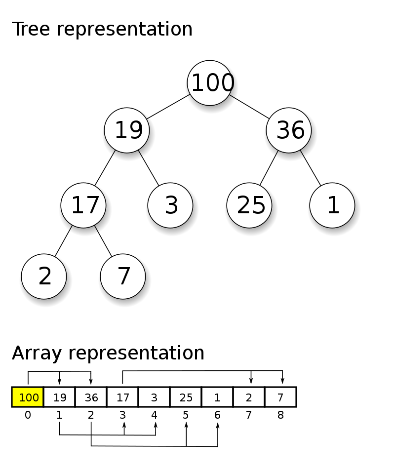

# README: Trabalho de Aquecimento

# OBJETIVOS

Foi proposto pelo Prof. Me. <b>Michel Pires da Silva</b> na disciplina de <b>Algoritmos e Estrutura de Dados II</b>, um trabalho no qual o objetivo era <b>criar um <i>heap</i> com os </b><i>'K'</i><b> elementos que mais se repetiam durante o texto de entrada inserido pelo usuário.</b>

Sendo assim, após a conclusão do projeto, temos aqui um algorítmo capaz de ler 'n' arquivos de texto como entrada e como saída, retornar para o usuário, um heap que contém os <i>'K'</i> mais repetidos elementos encontrados durante a análise de cada um dos textos.  
<b>- [✔️] Ler vários arquivos de entrada; </b>
<b>- [✔️] Salvar o conteúdo de cada um deles em uma Tabela Hash; </b>
<b>- [✔️] Remover as Stopwords; </b>
<b>- [✔️] Criar um Heap com as K palavras que mais apareceram;  </b>

Vale informar aos que não conhecem, que as estruturas: <i>unordered_Map</i> e <i>vector</i> são próprias da linguagem C++, portanto, caso haja alguma dúvida quanto ao seu funcionamento, no site <i>CPlusPlus</i> é possível encontrar todas informações sobre estrutura, contexto, implementação e funções associadas de ambos. Também é válido introduzir o termo "<i>stopwords"</i> que nada mais são que palavras que devem ser desconsideradas durante a análise do texto, pois impactariam diretamente no resultado durante a contagem de repetições. Estas, são palavras como: <b>não, para, que, e, a, etc...</b> .

Após a apresentação do tema, bem como a demonstração da lógica, serão apresentados todos os resultados obtidos a partir dos testes feitos.

# INTRODUÇÃO

Nascido em Nova York, Robert W. Floyd (1936 - 2001) com 17 anos, concluiu o curso de bacharelado em artes liberais na Universidade de Chicago e em 1958 recebeu o título de Bacharel em física. A partir da década de 60, iniciou uma longa jornada de publicações de muitos trabalhos notáveis, dentre esses, o desenvolvimento do algoritmo de ordenação <i>HeapSort</i>.

<b>O que é um heap em programação?</b> Heap é uma estrutura de dados que organiza seus elementos de acordo com prioridades, onde existe um elemento que possui a maior (ou menor) prioridade no topo do heap, e existem elementos subordinados a ele, que são chamados de nós filhos. Cada nó filho pode conter zero, um ou mais de um nó filho. Os nós filhos que não possuem outros nós filhos são chamados de folhas.

<b>Características de um Heap</b>
<ul>
<li>Topo: Todo heap possui o elemento de maior (ou menor) prioridade no topo;</li>
<li>Ordem de Prioridade: Os elementos em um heap seguem uma ordem de prioridade específica, como um "max-heap" onde os pais têm prioridade sobre os filhos, ou um "min-heap" onde os pais têm menor prioridade;</li>
<li>Estrutura de Filhos: Cada nó pai pode ter zero, um ou mais filhos;</li>
<li>Nível (ou profundidade): é chamada a distância de um nó até o topo;</li>
<li>Altura: O número máximo de níveis entre o topo do heap e qualquer uma de suas folhas;</li>
<li>Folha: Um nó que não possui filhos.</li>
</ul>

Para um melhor entendimendo da representação de um Heap, a figura abaixo mostra mais de uma forma de representar um <i>
Heap</i> que contém os seguintes números: {100, 19, 36, 17, 3, 25, 1, 2, 7}

A figura acima, primeiro mostra um <i>Heap</i> representado em forma de árvore e, abaixo, o mesmo <i>Heap</i>,
entretanto, representado como um vetor. Sendo assim, depois de ser ordenado por um "max-heap", o maior elemento da <i>
Heap</i> fica na primeira posição do vetor. O filho esquerdo do nó que está na posição 'i', pode ser encontrado na
posição <code>'i + i'</code>, já o filho direito, estará na posição <code>'i + i + 1'</code>.

# LÓGICA UTILIZADA

No contexto do objetivo do trabalho, o procedimento inicial envolveu a leitura de um arquivo de <i>stopwords</i>, o qual
teria como conteúdo, todas aquelas palavras que deveriam ser desconsideradas durante o processamento do texto de
entrada. Essas palavras foram identificadas e inseridas em uma <i>Hash</i>.Logo após, os arquivos de entrada são lidos,
e caso alguma palavra fosse identificada também na Tabela Hash das <i>stopwords</i>, ela seria gravada em outra Tabela
Hash.
Depois desse processo, cada elemento dessa tabela foi inserido individualmente em um heap. A medida que ocorria a
inserção no heap, sua estrutura era automaticamente ajustada para perpetuar a palavra de maior frequência na posição
de destaque (índice 0) do vetor. Ao término desse processo, o vetor resultante é apresentado ao usuário por meio do
terminal da seguinte forma: <code>Posição 'int' Palavra: 'string' - Frequência: 'int'</code>. 
⚠️ Palavras com caracteres estranhos não foram consideradas,
exemplo: <b>"--", "^", "-", " — ", " —", "—", "”", "“", "-”", "——", "—"</b>.

<h2>⚙️ Estruturas: </h2>

As estruturas utilizadas foram as seguintes:

* unordered_map (C++);
* vector (C++).

Onde o <i>"unordered_map"</i> foi utilizado para criar a Tabela Hash, na qual os dados são armazenados após a leitura do
arquivo, e o <i>"vector"</i>, utilizado para conter a Heap.

O contêiner <i>"unordered_map"</i>, baseado em uma Tabela Hash, oferece acesso com custo O(1). No entanto, uma questão a
ser considerada com tabelas hash é que, quando muito populadas, a adição de novos itens pode resultar em colisões. Caso
colisões se tornem frequentes, a performance do programa pode ser afetada negativamente.

Para contornar essa situação, a estrutura realiza uma troca de funções. Essa nova função, dada a entrada, calcula a
posição onde o item será inserido na hash e, se necessário, recalcula a posição de todos os itens existentes. Esse
procedimento é uma operação mais intensiva e pode impactar consideravelmente o desempenho.

O uso do <i>"unordered_map"</i> é vantajoso, pois é uma estrutura já implementada em C++, tornando sua utilização direta
e simples. Além disso, a implementação interna do <i>"unordered_map"</i> é otimizada, superando potencialmente tabelas
hash manuais. Isso se deve às otimizações empregadas, incluindo técnicas não convencionais, como deslocamentos (shifts),
que podem ser observadas, por exemplo, nas funções da família MurmurHash. Isso contribui para um desempenho eficiente e
confiável.

O Heap foi construído dentro de um <i>"vector"</i> em vez de uma lista, principalmente por razões de praticidade. O uso
da estrutura <i>vector</i> oferece maior flexibilidade e simplicidade em comparação com uma lista, sendo uma escolha
mais natural para uma implementação que visasse simplicidade no código e no entendimento.

Como já citado anteriormente, o objetivo principal do trabalho não era implementar as estrutras e sim resolver o
problema dos 'K' primeiros elementos. Por conta disso, não estenderemos muito sobre as funcionalidades de tabelas hash,
nem do heap utilizado. Portanto, para o melhor entendimento das dos dois templates, recomendo o site CPPReference, presente
nas referências deste README.

<h2>🕗 Tempo: </h2>

Para coletar o tempo gasto entre cada interação, utilizou-se a biblioteca <code>< chrono ></code>. Após a captação, o tempo exibido para o usuário é apresentado 
em milisegundos.

# RESULTADOS E ANÁLISE

O computador no qual foi utilizado para realizar todos os testes que presentes abaixo possui as seguintes configurações:
Processador <b>i7
11800H</b>, <b>16GB</b> de memória principal, operando em <b> 3200MTs CL 22</b> e como Sistema Operacional foi usado
o <b>PopOS 22.04 LTS</b>.

Após a conclusão do projeto, uma etapa crucial consistiu na realização de uma série de testes. Mais precisamente, foram
conduzidos cinco testes para cada dimensão de heap: 5, 10, 15 e 20. Durante cada teste, mediu-se o tempo gasto desde o
início da leitura do arquivo de entrada até o momento da impressão da heap resultante. os resultados obtidos tiveram
como arquivo de entrada o livro "Dom Casmurro" e o arquivo "Semana Machado Assis", ambos cedidos pelo professor. As
<i>stopwords</i>, também foram definidas pelo professor em sala de aula.

Nessa fase de testes, a média aritmética dos tempos obtidos foi calculada e analisada, o que permitiu avaliar de maneira
confiável o desempenho do sistema em diferentes cenários de tamanho de heap. Esses resultados forneceram insights
valiosos sobre a eficácia e a eficiência do projeto como um todo.

| Tamanho da Heap Impressa | Arquivo de Entrada   | Tempo   (ms) | 
|--------------------------|----------------------|--------------|
| <i>"5"</i>               | Dom Casmurro         | 0.0668521    |
| <i>"10"</i>              | Dom Casmurro         | 0.0673466    | 
| <i>"15"</i>              | Dom Casmurro         | 0.0666766    |
| <i>"20"</i>              | Dom Casmurro         | 0.0698978    |
| <i>"5"</i>               | Semana Machado Assis | 0.297294     |
| <i>"10"</i>              | Semana Machado Assis | 0.303094     | 
| <i>"15"</i>              | Semana Machado Assis | 0.293005     |
| <i>"20"</i>              | Semana Machado Assis | 0.29918      |

Dado a tabela acima, é possível observar que o tamanho da Heap impressa não impactou praticamente em nada no tempo de
execução do programa. Isso aconteceu graças a forma com que o algorítmo foi implementado, onde cada palavra armazenada
na
tabela Hash era movida para a Heap, o que significa que, a cada interação, a estrutura da Heap era reorganizada em tempo
de execução.

<h2>📈 Conclusões: </h2>

Embora existam alternativas que possam potencialmente reduzir os custos computacionais da implementação, este trabalho
atingiu seus objetivos de maneira simples e compreensível. Algumas estruturas poderiam ter sido manualmente
implementadas ou substituídas, como é o caso do uso do vector para armazenar a heap, que poderia ser trocado por uma
list.

No entanto, com base nos resultados obtidos, foi possível concluir que é evidente que o fator que exerce maior impacto
na velocidade do programa é o tamanho dos arquivos de entrada. Conforme a intuição prevê, o tempo de execução aumenta à
medida que o tamanho de palavras presentes nos arquivos cresce.

# COMPILAÇÃO E EXECUÇÃO

O algorítmo disponibilizado possui um arquivo Makefile que realiza todo o procedimento de compilação e execução. Para
tanto, temos as seguintes diretrizes de execução:

| Comando      | Função                                                                                  |                     
|--------------|-----------------------------------------------------------------------------------------|
| `make clean` | Apaga a última compilação realizada contida na pasta build                              |
| `make`       | Executa a compilação do programa utilizando o gcc, e o resultado vai para a pasta build |
| `make run`   | Executa o programa da pasta build após a realização da compilação                       |

É válido ressaltar a importância de seguir as seguintes instruções para garantir o bom funcionamento do programa:

1. Certifique-se de ter o arquivo de stop words na pasta ["dataset"](./dataset) com o
   nome ["stopwords.txt"](./dataset/stopwords.txt).

2. Coloque os arquivo de entrada na mesma pasta, com o nome ["input0.txt"](./dataset/input0.txt).
    * Observação, em caso de mais de um arquivo, o segundo deverá se chamar "input1.txt", o terceiro "input2.txt" e
      assim por diante. Também será necessário mudar o tamanho da constante qnt, definido na main.

Seguindo essas orientações, o programa será capaz de executar corretamente e imprimir o resultado no terminal.

# BIBLIOTECAS

Para o funcionamento desejado, fora utilizadas as seguintes bibliotecas: 

<ul>
	<li><code>#include 'iostream'  </code></li>
	<li><code>#include 'fstream'</code></li>
	<li><code>#include 'chrono'</code></li>
	<li><code>#include 'string'</code></li>
	<li><code>#include 'vector'</code></li>
	<li><code>#include 'unordered_map'</code></li>
</ul>

# REFERÊNCIAS

<ul>
   <li>https://cplusplus.com/reference/iostream/</li>
    <li>https://cplusplus.com/reference/fstream/</li>
    <li>https://cplusplus.com/reference/chrono/</li>
    <li>https://cplusplus.com/reference/string/</li>
    <li>https://cplusplus.com/reference/vector/vector/</li>
    <li>https://cplusplus.com/reference/unordered_map/unordered_map/</li>
	<li><b>ROSEN, Kenneth</b>. Matemática Discreta e Suas Aplicações 6ª Ed. internet: https://www.mheducation.com/. 2009.</li>
	<li><b>CORMEN, Thomas</b>. Algoritmos - Teoria e Prática 3º Ed. internet: https://www.elsevier.com/pt-br, 2012.</li>
</ul>

# AUTOR

Criado por <b>César Henrique Resende Soares</b>;

Agradecimento especial a <b>Henrique Souza Fagundes</b> e ao <b>Daniel Alves Sanches</b>, ambos monitores da disciplina de AEDS II pela ajuda durante o desenvolvimento do trabalho.

Aluno do <b>4</b>° periodo do curso de `Engenharia da Computação` no [CEFET-MG](https://www.cefetmg.br)
